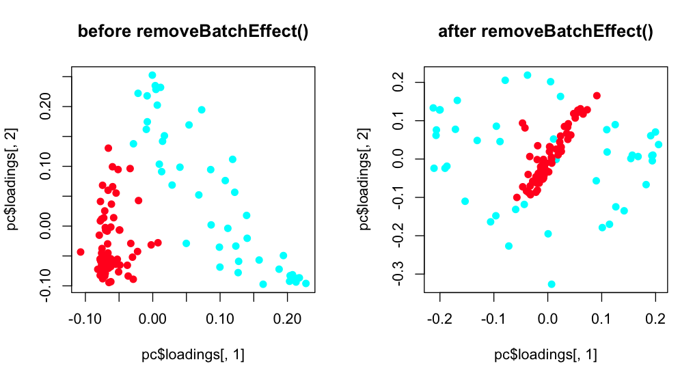
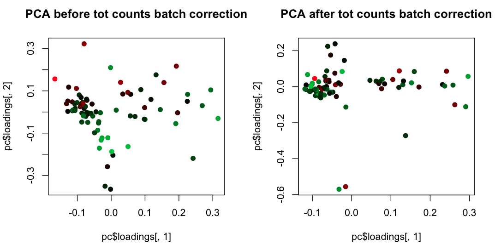

# Toying Around with Unsupervised Single Cell RNASeq Analysis

Unsupervised analysis of single cell transcriptomes is complicated by a number of factors that could be considered nuissance variations or batch effects, and here we're exploring various methods that are available to remove unwanted variation and better enable unsupervised analysis of variation among single cell transcriptomes.

Methods for removing unwanted variation in RNA-Seq data exist in Bioconductor and include the edgeR/limma removeBatchEffect() method, RUVSeq, and svaseq. Here, I'd like to provide examples of how to use such tools for preprocessing single cell RNA-Seq data.

Example single cell RNA-Seq count matrices are provided here (as approved by my collaborator from whom the samples belong to), but are de-identified so that they can be studied publicly only for the purpose of exploring data filtering techniques.  The data consists of two 96-well plates of single cells that are derived from the same type of cells, but prepped and eventually sequenced on a MiSeq on different days.  The data/ directory contains count matrices for each plate separately (plateA and plateB), and a single matrix containing both data.

Note, there may be actual interesting biological differences between these two plates of cells, but for some intents and purposes, it would be useful to study them as a single data set and unravel interesting variation among these cells that's not entirely tainted by which plate the sequences were derived from, or other nuisance biases such as the total numbers of reads sequenced for each cell.

Another disclaimer is that, although there are may not be 'perfect' strategies for doing this from a theoretical perspective (from what I hear), there may be otherwise useful bioinformatic and computational approaches that we can explore that should allow removing unwanted variation and better enable unsupervised analyses of combined data sets, with results that could be followed up on using other strategies.


## Using edgeR removeBatchEffect()

### Removing variation due to Plate A vs. Plate B

Given the combined matrix of cells corresponding to plates A and B, we can remove the variation that's correlated with the plate identifiers.

```
    R
    >source("PCA_paint_by_plate.removeBatchEffect.R")
```




## Removing variation due to counts of reads per cell

```
    R
    >source("PCA_paint_by_totalCounts.removeCovariates.R")
```




## Using RUVSeq

   TBD


## Using svaseq

   TBD


